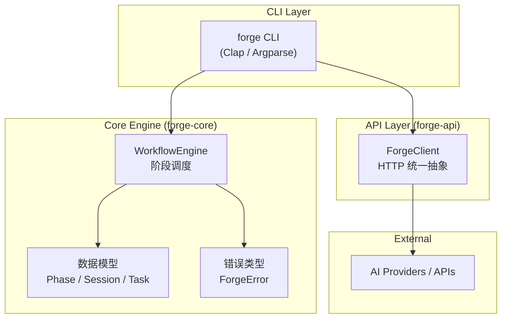

# 架构设计文档 — Sego-Forge

> **版本:** v0.1.0 | **日期:** 2026-05-21 | **作者:** 007M7

---

## 1. 系统概述

Sego-Forge 是一个**阶段化 AI 工作流编排引擎**，将任意开发任务拆分为可控的阶段流水线，并提供执行追踪和状态管理。

### 核心设计理念

- **阶段化**: 一切任务都是 Phase 的线性序列
- **可观测**: 每个 Phase 都有状态、耗时、详情
- **双语言**: Rust 高性能核心 + Python 快速原型验证
- **零依赖启动**: CLI 二进制可独立运行，无需额外配置

---

## 2. 系统架构



### 数据流

```
User Command → forge CLI → WorkflowEngine.add_phase()
                            ↓
                     Phase 1: Running → Completed
                            ↓
                     Phase 2: Running → Completed
                            ↓
                     Phase N: Running → Completed
                            ↓
                     WorkflowEngine.finish() → Session JSON
```

---

## 3. 核心模块

### 3.1 forge-core (Rust)

**职责**: 工作流引擎、数据模型、错误类型

```rust
pub struct WorkflowEngine {
    session: Session,
}

impl WorkflowEngine {
    pub fn new(title: String) -> Self;
    pub fn add_phase(&mut self, key: &str, name: &str);
    pub async fn execute_phase<F, Fut>(&mut self, key: &str, f: F) -> ForgeResult<()>;
    pub fn finish(self) -> Session;
}
```

每个 Phase 有五种状态:

| 状态 | 含义 |
|------|------|
| Pending | 尚未开始 |
| Running | 正在执行 |
| Completed | 执行成功 |
| Failed | 执行失败 |
| Skipped | 被跳过 |

### 3.2 forge-api (Rust)

**职责**: 统一的 HTTP 客户端抽象，隔离外部服务差异

### 3.3 forge-cli (Rust)

**职责**: 命令行工具，提供 `init` / `run` / `status` 三个子命令

### 3.4 Python 参考实现

```
src/core.py   ←→  rust/crates/forge-core  (镜像)
src/cli.py    ←→  rust/crates/forge-cli   (镜像)
```

---

## 4. 技术选型

| 决策 | 选择 | 理由 |
|------|------|------|
| 核心语言 | Rust | 零成本抽象、内存安全、高性能 |
| 异步运行时 | tokio | 成熟的 Rust 异步生态 |
| 参考实现 | Python | 快速原型、便于评委理解 |
| 序列化 | serde / serde_json | Rust JSON 标准 |
| CLI | Clap | Rust CLI 首选框架 |
| 测试 | cargo test + pytest | 双语言独立验证 |
| CI/CD | GitHub Actions | 零配置、免费、与 GitHub 深度集成 |

---

## 5. 扩展性设计

- **Phase 是可插拔的**: 通过 `add_phase()` 动态注册
- **Client 是可替换的**: `ForgeClient` 通过 trait 抽象
- **双语言保证正确性**: Rust 核心 + Python 验证，互相校验

---

## 6. 与 Sego-Agent 的关系

Sego-Forge 从 [Sego-Agent](https://github.com/007M7/Sego-Agent) 项目中提取了以下能力:

| 能力 | 来源 | 改进 |
|------|------|------|
| 阶段化进度 UI | `progress_ui.py` | 升级为通用引擎 |
| 工作日志持久化 | `work_log.py` | 内建到 Session 模型 |
| Rust 多 crate 架构 | `rust/crates/*` | 精简为 3 crate |
| CI/CD 流水线 | `.github/workflows/*` | 双语言并行测试 |
